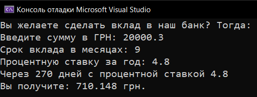
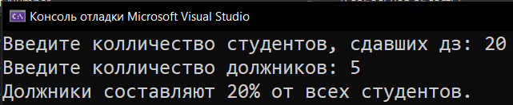
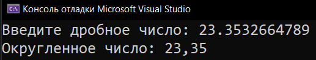
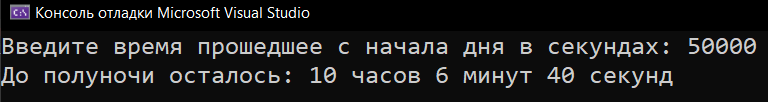

# Homework_5_Modul-Division
Д/з: Modul division

<a href="https://gist.github.com/SlavikArt/9c8405b71ea0ce8c8f849c955305ad48">Gist - страница со всеми кодами проектов</a>

* [Bank_Deposit_At_Interest](Bank_Deposit_At_Interest)
* [Earth's_Surface_Area](Earth's_Surface_Area)
* [Percent_Of_Number](Percent_Of_Number)
* [Round_Float](Round_Float)
* [Time_Left_To_Midnight](Time_Left_To_Midnight)

    <h2>Bank deposit at interest</h2>
    
Посчитать выплаты с процентом.

    
    <h2>Earth's surface area</h2>
    
Рассчитать поверхность Земли.

    
    <h2>Percent of number</h2>
    
Посчитать процент от числа.

    
    <h2>Round float</h2>
    
Округлить дробное число до 2-х знаков после запятой.

    
    <h2>Time left to midnight</h2>
    
Вычислить сколько времени осталось до полуночи.

    

